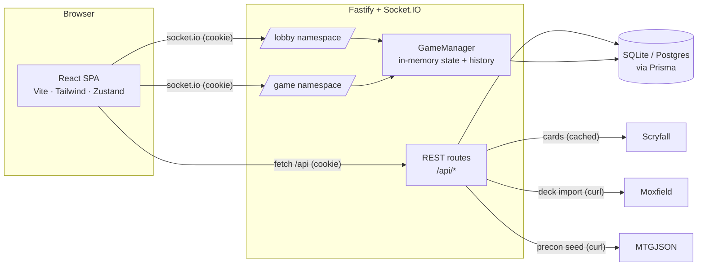

# Architecture

A pnpm monorepo with three packages: a React SPA (`apps/web`), a Fastify +
Socket.IO API (`apps/server`), and shared TypeScript contracts
(`packages/shared`) imported by both so the wire protocol is typed end-to-end.

## High-level



In dev, Vite proxies `/api` and `/socket.io` to the server on `:4000`, so the
browser is always same-origin and the httpOnly JWT cookie is first-party. Socket
connections authenticate from that same cookie in the handshake.

## Game model (honor system)

```mermaid
sequenceDiagram
  participant A as Player A
  participant S as Server (GameManager)
  participant B as Player B
  A->>S: game:action (move_card / tap / draw …)
  Note over S: snapshot pre-state (undo ring),<br/>apply action, bump version, append log
  S-->>A: game:state (redacted for A)
  S-->>B: game:state (redacted for B)
  Note over S: A's hand visible to A only;<br/>libraries hidden from everyone
```

The server is authoritative over state and hidden information but does **not**
enforce MTG rules — players move their own cards freely (like Cockatrice).
Authoritative state lives in memory (`GameManager`) and is snapshotted to the
`Game` table (debounced) for reconnect/restart recovery. A per-game ring of
pre-action snapshots powers single-step undo.

## Layout

```
packages/shared/src/   cards · decks · auth · game · lobby · socket · social
apps/server/src/
  app.ts / index.ts    Fastify build + HTTP/Socket.IO listener
  auth/                JWT sign/verify, requireAuth hook
  routes/              auth · cards · decks · precons · matches
  services/            scryfall (cache) · moxfield · deck · http (curl)
  game/                state builder · action engine · GameManager
  sockets/             auth middleware · rooms · lobby ns · game ns
  metrics.ts · observability.ts
apps/web/src/
  pages/               Landing · Login/Register · Lobby · Decks · Editor · Precons · Matches · Game
  components/ + components/game/
  store/               zustand: auth · lobby · game · cards · theme · settings · hover
  lib/                 api · socket · helpers
```

## Key decisions

- **Honor-system game**, not a rules engine — keeps scope tractable and matches
  how playgroups actually play online.
- **Curl-based fetch for Cloudflare-fronted upstreams** (Moxfield, MTGJSON):
  Node's undici `fetch` is blocked by TLS fingerprinting; the system `curl` is
  not. See `services/http.ts`.
- **Per-viewer state redaction** server-side, so hidden information never reaches
  a client that shouldn't see it.
- **SQLite for dev, Postgres for prod** via a mirrored Prisma schema; production
  syncs with `prisma db push` (providers differ, so no shared migration history).
