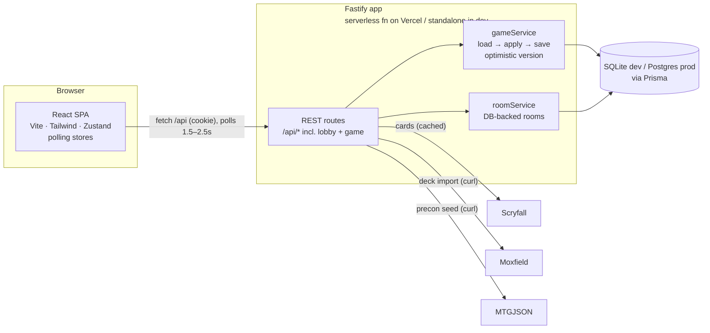

# Architecture

A pnpm monorepo with three packages: a React SPA (`apps/web`), a Fastify API
(`apps/server`), and shared TypeScript contracts (`packages/shared`) imported by
both so the wire protocol is typed end-to-end. Realtime is **HTTP polling**
against DB-backed state — no WebSockets — so the whole app (SPA + API) runs on
Vercel: static files plus one serverless function (`api/index.ts`).

## High-level



In dev, Vite proxies `/api` to the standalone server on `:4000`; on Vercel the
same Fastify app is served by `api/index.ts` behind `/api/*` rewrites. Either
way the browser is same-origin and the httpOnly JWT cookie is first-party.

## Game model (honor system, stateless servers)

```mermaid
sequenceDiagram
  participant A as Player A
  participant S as API (any instance)
  participant DB as Database
  participant B as Player B
  A->>S: POST /games/:id/action (move_card / tap / draw …)
  S->>DB: load state · push undo snapshot · apply · save (version guard)
  S-->>A: fresh redacted view (instant feedback)
  B->>S: GET /games/:id/state?since=v (poll, ~1.5s)
  S-->>B: new redacted view (version changed)
  Note over S: A's hand visible to A only;<br/>libraries hidden from everyone
```

The server is authoritative over state and hidden information but does **not**
enforce MTG rules — players move their own cards freely (like Cockatrice).
Authoritative state lives in the `Game` row; every action loads → applies →
saves with an optimistic `version` guard (one retry on conflict). The last ~10
pre-action snapshots (`history` column) power undo. Presence is a `lastSeenAt`
heartbeat refreshed by polls; `connected`/`disconnectedAt` are derived at read
time. Lobby rooms are `Room` rows (stale waiting rooms GC'd lazily on list).

## Layout

```
api/index.ts             Vercel serverless entry (serves the whole Fastify app)
packages/shared/src/     cards · decks · auth · game · lobby · chat · social
apps/server/src/
  app.ts / index.ts      Fastify build + standalone listener (dev/Docker)
  auth/                  JWT sign/verify, requireAuth hook
  routes/                auth · cards · decks · precons · matches · lobby · game
  services/              scryfall (cache) · moxfield · deck · rooms (DB) · http (curl)
  game/                  state builder · action engine · stateless gameService
  metrics.ts · observability.ts
apps/web/src/
  pages/                 Landing · Login/Register · Lobby · Decks · Editor · Precons · Matches · Game
  components/ + components/game/
  store/                 zustand: auth · lobby (polling) · game (polling) · cards · theme · settings · hover
  lib/                   api · realtime (polling) · helpers
```

## Key decisions

- **Honor-system game**, not a rules engine — keeps scope tractable and matches
  how playgroups actually play online.
- **Polling over WebSockets** — a card game tolerates 1–2s peer latency, and it
  buys single-platform serverless hosting (Vercel) with zero realtime infra.
  Your own actions render instantly (the POST returns the fresh view).
- **Curl-based fetch for Cloudflare-fronted upstreams** (Moxfield, MTGJSON):
  Node's undici `fetch` is blocked by TLS fingerprinting; the system `curl` is
  not. See `services/http.ts`.
- **Per-viewer state redaction** server-side, so hidden information never reaches
  a client that shouldn't see it.
- **SQLite for dev, Postgres for prod** via a mirrored Prisma schema; production
  syncs with `prisma db push` (providers differ, so no shared migration history).
